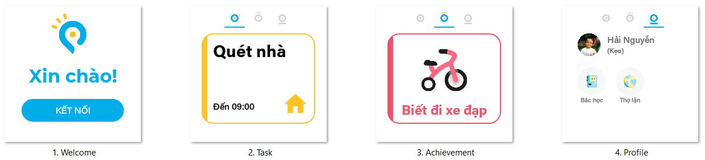
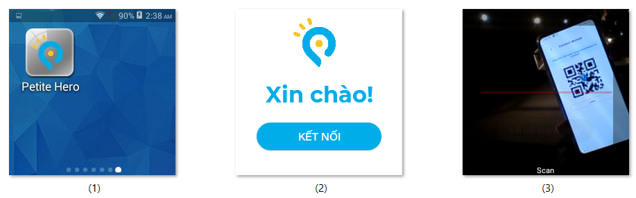
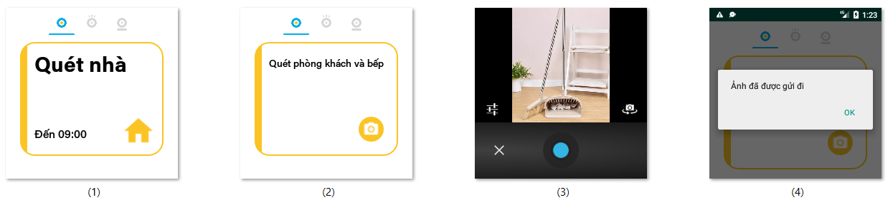
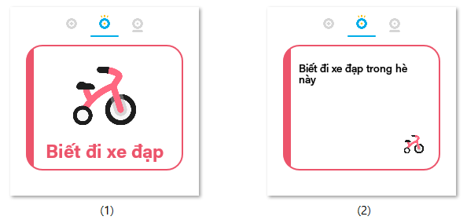
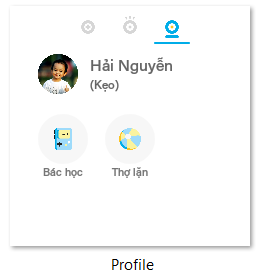

# [PETITE HERO](https://github.com/petite-hero) - FPT University Capstone Project
# Software Engineering Specialization
This repo contains the **Smartwatch Application** in the system
- Language: Java
- OS: Android 4.4.2
- Developed with Android Studio

# Contributors
- [Nguyễn Phú Hưng](https://github.com/hulk1999)
- [Võ Lam Trường](https://github.com/llduong)
- [Lâm Lệ Dương](https://github.com/llduong)
- [Âu Đức Tuấn](https://github.com/ibenrique2510)

# Functionalities
1. Retrieve & Report Device Locations
2. Manage Tasks
3. Manage Achievements
4. Show Profile & Badges

# Screenshots
## 1. Setting Up

## 2. Task Management

## 3. Achievement Management

## 4. Showing Profile & Badges
